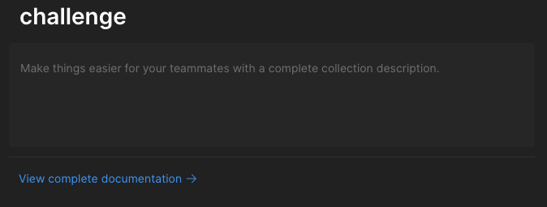

# App challenge

## How to run the app

1. First, clone the repository to your local machine using the following command:

```bash
git clone git@github.com:Brianmax/ravnChallenge.git
```

2. Change to the directory of the project:

```bash
cd ravnChallenge
```

3. Run with docker-compose:

```bash
docker-compose -f docker-compose.dev.yml up -d
```
4. Open the postman collection and import it to your postman app, you can find it in the following path:

```bash
ravnChallenge/postman/MoviesCatalogChallenge.postman_collection.json
```

# Endpoints

Information about the endpoints can be found in the postman collection. Click on `View complete documentation`.


# Posters for the movies

The posters for the movies are stored in minio, you can access the minio web interface using the following credentials:

- Access Key: minio
- Secret Key: minio123
- URL: http://localhost:9000
- Bucket: movies

You can upload posters multiple times, the last upload will overwrite the previous one.

# Cache

The cache feature is implemented using Redis. The time to live for the cache is 5 minutes.

# Authentication

The authentication is implemented using JWT. The token is valid for 10 minutes. The token is sent in the Authorization header.
If the token expires, the server will return the following response:
    
```json
{
    "message": "Token expired"
}
```

# Swagger

The swagger documentation can be found in the following URL:
[http://localhost:8080/swagger-ui/index.html#/](http://localhost:8080/swagger-ui/index.html#/)

# Database

The database is populated with the following data:

## Users
```json
[
    {
        "email": "admin@example.com",
        "password": "password",
        "role": "ADMIN"
    },
    {
        "email": "user@example.com",
        "password": "password",
        "role": "USER"
    }
]
```
## Categories
```json
[
    {
        "name": "Science Fiction"
    },
    {
        "name": "Action"
    },
    {
        "name": "Drama"
    },
    {
        "name": "Comedy"
    },
    {
        "name": "Horror"
    },
    {
        "name": "Thriller"
    }
]
```


## Movies
```json
[
    {
        "name": "Interstellar",
        "releaseYear": 2014,
        "synopsis": "A team of explorers travel through a wormhole in space in an attempt to ensure humanity's survival.",
        "categories": [
            "Science Fiction"
        ],
        "createdBy": "admin@example.com",
        "createdAt": "2024-09-05",
        "updatedAt": null,
        "updatedBy": null,
        "deleted": false,
        "deletedAt": null,
        "deletedBy": null,
        "presignedUrl": "The movie does not have an image"
    },
    {
        "name": "Inception",
        "releaseYear": 2010,
        "synopsis": "A skilled thief is given a chance at redemption if he can successfully perform inception.",
        "categories": [
            "Science Fiction"
        ],
        "createdBy": "admin@example.com",
        "createdAt": "2024-09-05",
        "updatedAt": null,
        "updatedBy": null,
        "deleted": false,
        "deletedAt": null,
        "deletedBy": null,
        "presignedUrl": "The movie does not have an image"
    },
    {
        "name": "The Dark Knight",
        "releaseYear": 2008,
        "synopsis": "Batman battles the Joker, who plunges Gotham City into anarchy.",
        "categories": [
            "Action"
        ],
        "createdBy": "admin@example.com",
        "createdAt": "2024-09-05",
        "updatedAt": null,
        "updatedBy": null,
        "deleted": false,
        "deletedAt": null,
        "deletedBy": null,
        "presignedUrl": "The movie does not have an image"
    },
    {
        "name": "The Matrix",
        "releaseYear": 1999,
        "synopsis": "A hacker discovers the truth about his reality and his role in the war against its controllers.",
        "categories": [
            "Science Fiction"
        ],
        "createdBy": "admin@example.com",
        "createdAt": "2024-09-05",
        "updatedAt": null,
        "updatedBy": null,
        "deleted": false,
        "deletedAt": null,
        "deletedBy": null,
        "presignedUrl": "The movie does not have an image"
    },
    {
        "name": "The Godfather",
        "releaseYear": 1972,
        "synopsis": "The aging patriarch of an organized crime dynasty transfers control of his empire to his reluctant son.",
        "categories": [
            "Drama"
        ],
        "createdBy": "admin@example.com",
        "createdAt": "2024-09-05",
        "updatedAt": null,
        "updatedBy": null,
        "deleted": false,
        "deletedAt": null,
        "deletedBy": null,
        "presignedUrl": "The movie does not have an image"
    }
]
```
